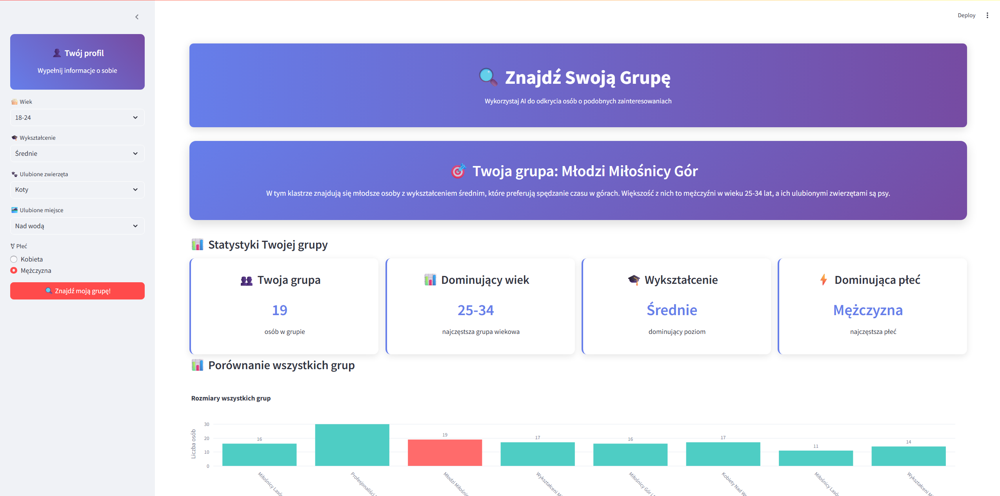

# 👥 Find Friends

## 📋 O projekcie

**Find Friends** to interaktywna aplikacja Streamlit, która pozwala użytkownikowi odkryć swoją "grupę" — osoby o podobnych cechach i zainteresowaniach — na podstawie analizy danych oraz klasteryzacji za pomocą AI. Wykorzystując model uczenia maszynowego (PyCaret), aplikacja przypisuje użytkownika do jednej z grup, pokazując wizualizacje, statystyki oraz rekomendacje działań społecznych.

## 📱 Demo



> Możesz uruchomić aplikację lokalnie lub na [Streamlit Cloud](https://ffind-friends.streamlit.app/).

## 📁 Struktura projektu

```
find-friends/
│
├── app.py
├── requirements.txt
├── welcome_survey_simple_v1.csv
├── welcome_survey_clustering_pipeline_v1.pkl
├── welcome_survey_cluster_names_and_descriptions_v1.json
└── others/
    └── find-friends.png

```
## ⚙️ Technologie
---
- **Streamlit** – szybkie prototypowanie aplikacji webowych
- **PyCaret** – uproszczony framework do machine learningu
- **Pandas** – manipulacja danymi
- **Plotly** – interaktywne wizualizacje danych
- **scikit-learn** – backend ML (używany przez PyCaret)
- **NumPy** – operacje numeryczne


## 🛠️ Instalacja
---

   ```bash
   # Sklonuj repozytorium
   git clone https://github.com/skwarlinski/find-friends.git
   cd find-friends
 
   # Zainstaluj zależności
   pip install -r requirements.txt

   # Uruchom aplikację
   streamlit run app.py
   ```

## 🧠 Podejście i rozwiązania techniczne

- Aplikacja używa wytrenowanego modelu klasteryzacji z **PyCaret** do grupowania użytkowników na podstawie ich odpowiedzi.

- Formularz w pasku bocznym umożliwia podanie informacji o sobie (wiek, płeć, wykształcenie, preferencje).

- Na podstawie predykcji użytkownikowi przypisywana jest jedna z grup, dla której generowane są:

    - Statystyki i metryki grupy

    - Porównania z innymi grupami

    - Rekomendacje działań

- Obsługiwany jest tryb demo — aktywowany automatycznie w przypadku braku wymaganych plików.

- Wykorzystano `st.cache_data` do buforowania modeli i danych.

## 📬 Kontakt

Masz pytania lub sugestie? Odezwij się!

- 💼 [LinkedIn](https://www.linkedin.com/in/hubert-skwarlinski-895437368/)
- 💻 [GitHub](https://github.com/skwarlinski)
- ✉️ Email: [skwarlinskihubert@gmail.com](mailto:skwarlinskihubert@gmail.com)